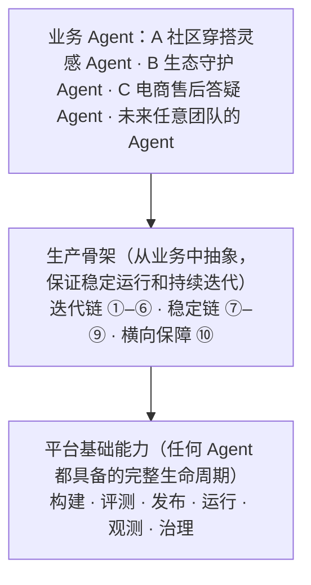
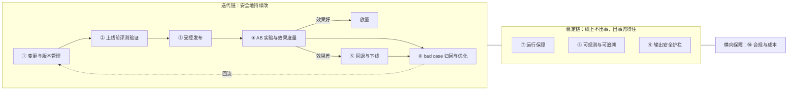

# 统一 Agent 基建平台｜笔试作答

> 身份设定：公司级 Agent 基建平台产品经理。三个输入需求：A 社区穿搭灵感 Agent、B 生态守护 Agent、C 电商售后答疑 Agent。
> 作答范围：① 抽象出通用骨架；② 列出完整的功能模块，并划分 MVP（一期）和二期的边界。

---

## 0. 先说结论

- **两层结构：先有平台基础能力，再有生产骨架。**
  - **平台基础能力**面向公司内**任意**团队。它是一套完整、通用的 Agent 生命周期能力：构建、评测、发布、运行、观测、治理。任何 Agent 都能在平台上从零走到上线。它回答的是「能不能做、能不能上线」。
  - **生产骨架**从 A、B、C 三个业务中抽象而来。它说明在高并发、高准确、高频迭代的压力下，上面每个环节还要做到什么程度，以及这些环节怎样串成闭环。它回答的是「能不能在生产环境稳定运行、持续迭代」。
- **通用能力从个性化需求中抽象而来。** A 的个性化在于「快」（快速响应、快速迭代、快速试错），B 在于「准」（判得准、验得严、查得到），C 在于「稳」（知识准确、波峰扛得住、回复不越界）。方法是去掉业务名词、保留机制，再把业务差异变成配置参数。每一项通用能力都能追溯到具体团队的需求。
- **生产骨架共 10 项，分三组：**
  - **迭代链**：① 变更与版本管理 → ② 上线前评测验证 → ③ 受控发布 → ④ AB 实验与效果度量 → ⑤ 回退与下线 → ⑥ bad case 归因与优化，再回到 ①。
  - **稳定链**：⑦ 运行保障、⑧ 可观测与可追溯、⑨ 输出安全护栏。
  - **横向保障**：⑩ 合规与成本。
- **Agent 在线上直接输出结果。** 人工从「逐条处理」退到「设计、评测、调优、bad case 归因、优化」这些环节，只对低置信度或高风险的结果做兜底和抽检。
- **MVP 边界 = 完整的基础能力 + 骨架里「不做就不能安全上线」的部分。** 依赖线上数据积累的智能化能力、属于提效的自动化能力放到二期；公司已有平台能提供的（实验平台、标注、内容安全、监控、算力）直接对接，不重建。

---

## 一、抽象共性结构

### 1.1 平台基础能力：一个完整的通用 Agent 平台

#### 1.1.1 什么是平台上的「通用 AI Agent」

**定义：** 通用 AI Agent 指公司内任何业务团队，不写或少写代码，只通过平台配置就能构建出来的一个 LLM 应用。它能理解输入、调用模型、按需检索知识和调用工具，输出约定格式的结果，并且可以被评测、发布、观测和回退。

**一个通用 Agent 由 8 个要素组成：**

| 要素 | 说明 |
|---|---|
| 目标与契约 | 这个 Agent 解决什么问题；输入和输出的格式（Schema） |
| 模型 | 用哪个模型、什么参数 |
| 指令 | Prompt 和变量 |
| 编排 | 单步、多步或多轮的执行流程 |
| 工具 | 可以调用的内部接口（白名单） |
| 知识 | 引用的知识库 |
| 记忆 | 会话上下文 |
| 运行策略 | 调用方式、限流、发布策略、质量门槛 |

#### 1.1.2 基础能力清单：覆盖完整生命周期

| 环节 | 基础能力（任何 Agent 进入平台就具备） | 作用 |
|---|---|---|
| **构建** | 模型接入（统一网关）、Prompt 与编排、工具注册、知识库（RAG）、会话记忆、结构化输出、调试台、场景模板 | 业务方通过**配置**做出一个 Agent，不从零写代码；模型、知识、工具这些通用组件做一次，所有团队共用 |
| **评测** | 评测集管理、离线批量跑分、新旧版本对比报告 | 上线前知道这个版本「好不好」，而不是凭感觉 |
| **发布** | 版本快照、开发 / 预发 / 生产三套环境、发布、回退、下线 | 每次改动都有版本，能上线，也能退回去 |
| **运行** | API 和 SDK、在线调用（同步和流式） | 业务系统用统一方式调用 Agent |
| **观测** | 调用日志、基础监控（调用量、延迟、错误率、Token 用量） | 上线后能看见它在怎么跑 |
| **治理** | 团队空间、角色权限（编辑 / 发布 / 审核）、接入公司内容安全 | 多个团队共用平台时互不干扰，谁能改、谁能发都有明确规定 |

**平台对任何 Agent 的四个默认承诺：** 开箱即用（有模板，当天就能跑通第一个版本）、默认安全（自动接入内容安全和权限）、默认可回退（每次发布都有版本）、默认可观测（每次调用都有日志）。

#### 1.1.3 两层关系

> 文字版：底层是平台基础能力，每个环节都有；中间是生产骨架，把每个环节做到生产级并串成闭环；最上层是具体的业务 Agent。
>
> 打个比方：基础能力是一辆车该有的零件都齐了，能开；生产骨架是这辆车要跑长途、跑高速时还需要的加固和配套，比如 ABS、行车记录仪、定期保养体系。

---

### 1.2 生产骨架：从三个业务中抽象

#### 1.2.1 推导：三个 Agent 与通用 Agent 的对比

| 维度 | **通用 Agent（平台默认）** | A 社区穿搭灵感 Agent | B 生态守护 Agent | C 电商售后答疑 Agent |
|---|---|---|---|---|
| 调用形态 | 在线同步调用 | 在线同步，C 端直连 | **离线批量**，海量调用 | 在线**多轮会话** |
| 稳定运行的压力 | 中等流量，标准限流 | 百万级日调用，**延迟敏感** | 看吞吐量，长期不下线 | 中高流量，**大促有波峰** |
| 迭代的对象 | Prompt、模型、知识 | 玩法和推荐策略，**每周迭代** | **政策红线** | **售后知识** |
| 质量标准 | 业务方自定义评测集 | 采纳率、点击、留存 | **准确性极高**，要能给出依据 | 回答正确、政策不过期 |
| 上线要求 | 预发验证后发布，可以回退 | 灰度放量、新旧版本对比，不行就快速回退或下线 | **严格验证**，可回溯、可回退 | 知识更新后稳定运行，随大促起落 |
| 线上输出 | Agent 直接输出 | 直接给用户推荐 | 直接输出判定结论（类别 + 理由） | 直接回复用户 |
| 线上反馈信号 | 业务方自定义 | 采纳、点击、留存 | 创作者**申诉率、申诉改判率**，人工抽检 | 满意度、追问率、主动要求转人工的比例 |
| 人工角色 | 设计、评测、调优、归因 | 同左 | 同左 + 低置信度复核 + 抽检 | 同左 + 高风险问题转人工 |

**从这张表得出两个结论：**

1. **改的东西不同，改的流程一样。** A 改策略，B 改政策，C 改知识，但都要经历「变更 → 验证 → 受控上线 → 看效果 → 放量、回退或下线 → 找问题再改」。这条流程就是**迭代链**。
2. **压力的形态不同，要解决的问题一样。** A 是并发，B 是批量，C 是波峰，但都要扛得住、出事能兜住、事后查得清，而且 Agent 的输出直接到达用户，发出前必须把好关。这就是**稳定链**。

再加上所有团队都关心的合规和成本，就是生产骨架要解决的全部问题。下面先逐条拆解每个团队的个性化需求，看它们分别抽象成了哪些通用能力，再归纳成 10 项骨架。

#### 1.2.2 从个性化需求到通用能力

**抽象方法：三步。**

1. **找原话**：从题干里找出每个团队的具体需求。
2. **去掉业务名词，留下机制**：比如「对比新老版本的采纳率、点击、留存」，去掉「采纳率、点击、留存」这些业务指标，剩下的机制是「任意业务指标都能按版本做对比」。
3. **把机制做成平台能力，业务差异变成配置参数**：A 配采纳率，C 配解决率，用的是同一个 AB 实验能力。

按这个方法，逐个拆解三个团队。

**A 社区穿搭灵感 Agent：个性化在于「快」，快速响应、快速迭代、快速试错**

| 题干原话 | 个性化能力需求 | 抽象成的通用能力 | 作用 |
|---|---|---|---|
| 用户说出场景，给出穿搭灵感，推荐社区里的同款笔记 | 按场景检索社区笔记，再生成建议 | **工具中心 + 知识检索**（基础） | 让 Agent 安全地调用业务已有的检索和推荐接口，不用把数据搬进平台 |
| 日调用百万级、高并发、对响应速度敏感 | 低延迟、高并发的在线服务 | **性能加速与资源隔离**（⑦） | 用缓存、小模型、流式输出降低延迟；独立配额，高峰时不挤占其他团队 |
| 玩法与推荐策略几乎每周迭代 | 策略快速修改、快速上线 | **配置化变更与版本管理**（①） | 改策略不用发代码；每次改动都有版本，可以对比、可以复原 |
| 每次上新都要灰度放量 | 用小流量试新版本 | **受控发布：比例灰度 + 会话粘性**（③） | 把新版本的影响控制在小范围；同一用户不会在新旧版本之间来回跳 |
| 对比新老版本的效果（采纳率、点击、留存） | 新旧版本效果对比 | **AB 实验与版本归因**（④） | 流量分组，业务指标能对应到具体版本，用数据决定是否放量；留存需要留出足够的观察时间 |
| 表现好则放量，不好则快速回退或下线 | 快速止损 | **分钟级回退与下线**（⑤） | 效果差时，几分钟内恢复旧版本或整体下线 |
| 面向 C 端用户 | 推荐内容安全 | **输出安全护栏**（⑨） | 过滤违规和不可见的笔记，Agent 的回复直接到达用户前再把一次关 |

**B 生态守护 Agent：个性化在于「准」，判得准、验得严、查得到**

| 题干原话 | 个性化能力需求 | 抽象成的通用能力 | 作用 |
|---|---|---|---|
| 基于政策红线和社区生态导向 | 以政策作为判定依据 | **带版本的知识库**（基础 + ①） | 政策作为知识管理，每次判定都能引用具体条款；政策改了就是一个新版本 |
| 输出结构化结论（类别 + 理由） | 固定格式的输出 | **结构化输出与格式校验**（基础 + ⑨） | 保证下游系统能直接使用结论；理由必须引用政策条款 |
| 海量批量调用 | 离线批量处理 | **批量执行模式**（⑦） | 排队、并发控制、失败重跑、结果回写；比逐条在线调用更便宜、更稳定 |
| 对准确性要求极高 | 高准确，拿不准时有兜底 | **分场景评测门槛**（②）+ **低置信度转人工**（⑦） | 按违规类别评测，红线样本单列、零容忍；模型没把握的结果交给人工复核 |
| 政策驱动更新，每次上线必须严格验证 | 上线前强制验证 | **强制上线门槛 + 影子 AB**（② ③ ④） | 不达标就不能发布；新版本先在真实数据上只跑不生效，和人工抽检的标注对比一致率，达标后再上小流量 |
| 长期稳定运行，要求可回溯可回退 | 任何历史判定都能查、能退 | **全链路追溯 + 审计 + 版本回退**（⑧ ⑩ ⑤） | 任何一条判定都能查到当时的版本、依据和理由；政策版本出错可以退回 |

**C 电商售后答疑 Agent：个性化在于「稳」，知识准确、波峰扛得住、回复不越界**

| 题干原话 | 个性化能力需求 | 抽象成的通用能力 | 作用 |
|---|---|---|---|
| 嵌入客服工作台 | 嵌入现有业务系统 | **统一 API / SDK**（基础） | 业务系统用标准方式接入，不用各自对接模型 |
| 多轮回答 | 多轮对话 | **会话管理 + 按会话分流**（基础 + ③ ④） | 记住上下文；做实验时按会话分组，一次对话里不切换版本 |
| 回答退换货、物流、售后政策 | 查订单和物流，引用售后政策回答 | **工具中心 + 知识库**（基础）+ **承诺类话术拦截**（⑨） | 查实时数据、引用政策回答；拦截擅自承诺退款、赔付等越权回复 |
| 主要靠知识更新迭代 | 知识频繁更新而且不出错 | **知识版本 + 生效时间 + 变更回归**（① ②） | 新政策按时生效、旧政策按时失效；知识改动先回归评测再上线 |
| 流量中高、大促有波峰 | 扛住流量波峰 | **容量规划与降级**（⑦） | 大促前压测、扩容；超出容量时限流、降级、转人工 |
| 稳定运行、随大促起落 | 按大促节奏调整 | **按计划切换版本和容量**（① ⑦） | 大促前切到大促专用的知识和容量配置，大促结束后恢复日常配置 |

**汇总：通用能力来自哪里、还能服务谁**

> ● 强需求（驱动这项能力建设）　○ 也需要

| 通用能力 | 骨架 | A | B | C | 未来还能复用到的业务 |
|---|---|:-:|:-:|:-:|---|
| 工具中心（调用业务接口） | 基础 | ● | ○ | ● | 任何需要查业务数据的 Agent |
| 带版本和生效时间的知识库 | 基础 + ① | ○ | ● | ● | 商家规则答疑、内部制度问答 |
| 结构化输出与格式校验 | 基础 + ⑨ | ○ | ● | ○ | 内容打标、信息抽取 |
| 会话管理 | 基础 | ○ | | ● | 任何对话式助手 |
| 性能加速与资源隔离 | ⑦ | ● | | ○ | 搜索助手等 C 端实时场景 |
| 批量执行模式 | ⑦ | | ● | | 内容打标、数据清洗、离线摘要 |
| 容量规划与降级 | ⑦ | ● | ○ | ● | 所有有流量峰值的业务 |
| 低置信度转人工 | ⑦ | | ● | ● | 所有高风险决策类场景 |
| 强制上线门槛 | ② | ○ | ● | ○ | 审核、风控、合规类 Agent |
| 灰度与影子发布 | ③ | ● | ● | ○ | 所有需要持续迭代的 Agent |
| AB 实验与版本归因 | ④ | ● | ○ | ○ | 所有以业务指标衡量效果的 Agent |
| 分钟级回退与下线 | ⑤ | ● | ● | ● | 所有 Agent |
| 全链路追溯与审计 | ⑧ ⑩ | ○ | ● | ○ | 审核、风控、金融、交易类场景 |
| 输出安全护栏 | ⑨ | ● | ○ | ● | 所有直接面向用户的 Agent |

**从汇总表能看出：**

1. **每一项通用能力，都能追溯到至少一个团队的具体需求**，不是凭空设计的。
2. **只有一个团队强需要的能力，也值得做成平台能力**，比如批量执行只有 B 强需要，但内容打标、数据清洗等后续业务都会用到。判断标准是「未来的复用面」，而不是「现在有几个团队要」。
3. **三个团队都强需要的能力，是平台最核心的部分**，比如分钟级回退。它们要优先做、做扎实。

下面把这些通用能力归纳成 10 项生产骨架。

#### 1.2.3 骨架总览

> 文字版：迭代链是 ①→②→③→④，效果好就放量，效果差就 ⑤ 回退；④ 和 ⑤ 发现的问题进入 ⑥ 归因，修复后回到 ①，形成闭环。稳定链 ⑦⑧⑨ 在运行中持续起作用。⑩ 贯穿所有环节。

#### 1.2.4 每一项的作用，以及和基础能力的关系

| # | 骨架能力 | 作用：解决什么问题 | 基于哪项基础能力 | 生产级在其上增加了什么 | 人工参与 |
|---|---|---|---|---|---|
| ① | **变更与版本管理** | 回答「改了什么」。统一管理所有会影响效果的变更，每次上线都是一个可对比、可复原的版本 | 发布 · 版本快照 | 知识和政策也纳入版本；**锁定被动依赖**（模型版本、知识源、工具接口），一旦变化就触发回归评测 | 设计变更 |
| ② | **上线前评测验证** | 回答「改得对不对」。在改动触达用户之前发现效果退化 | 评测 | 按场景配置上线门槛；红线样本单列；用人工标注的样本作为基准；不达标时**强制阻断** | **标注评测集**、确定上线门槛 |
| ③ | **受控发布** | 回答「怎么上线才安全」。控制新版本影响的范围和速度 | 发布 | 按比例灰度；**会话粘性**（同一用户、同一会话不在两个版本间跳）；影子运行（新版本只跑不生效）；发布审批 | 审批 |
| ④ | **AB 实验与效果度量** | 回答「上线后效果怎么样」。新旧版本在真实流量上用同一口径对比，决定放量还是回退 | 发布 + 观测 | 流量分组实验；**业务指标能归到具体版本**；对接公司 AB 实验平台看显著性 | 解读结果、做放量决策 |
| ⑤ | **回退与下线** | 回答「效果不好怎么办」。把损失控制在最小 | 发布 · 回退 | **分钟级**回到任意历史版本；按指标自动熔断；暂停和下线 | 决策 |
| ⑥ | **bad case 归因与优化** | 回答「怎么越改越好」。把线上失败变成下一轮改进的输入 | 观测 + 评测 | 收集线上失败样本（用户反馈、申诉、抽检）；**定位问题出在哪一环**（Prompt、知识、模型、工具还是策略）；修复后回流评测集，防止同一问题再犯 | **归因、调优**：人工的核心工作 |
| ⑦ | **运行保障** | 回答「扛不扛得住，出事能不能兜住」 | 运行 | 在线之外增加**批量**和**会话**两种执行模式；容量规划；团队之间**资源隔离**；限流、超时、备用模型；降级兜底（包括**低置信度转人工**） | 大促预案、人工兜底 |
| ⑧ | **可观测与可追溯** | 回答「出了问题能不能查清楚」 | 观测 | 全链路 Trace（输入、每一步、检索到的依据、工具返回、输出、版本号）；**留存判定依据**；告警 | 排查问题 |
| ⑨ | **输出安全护栏** | Agent 的回复直接到达用户，中间没有人把关，所以发出前要再校验一次 | 治理 · 内容安全 | 格式校验；回答必须有引用来源；**承诺类话术拦截**（比如擅自承诺退款）；输出内容安全审核 | 制定规则 |
| ⑩ | **合规与成本** | 让 Agent 能长期、放心地运行 | 治理 | 操作审计；数据隐私保护；调用配额；单次成本和预算 | — |

#### 1.2.5 大模型带来的三个特殊难点

骨架里有几项设计，是专门针对大模型应用、传统软件发布中不存在的问题：

1. **被动变更。** 业务方什么都没改，线上效果也可能变差，因为模型厂商升级了模型，知识源的内容变了，或者下游工具接口改版了。所以 ① 要锁定这些依赖的版本，一旦变化就触发 ② 的回归评测。
2. **输出不确定。** 同样的输入，模型可能给出不同的输出，传统的单元测试「输入 X 必须输出 Y」不适用。所以 ② 靠评测集加统计指标来判断，④ 靠真实流量的 AB 对比来确认效果。
3. **直接输出，没有人工把关。** Agent 的回复直接到达用户，一旦出错影响就是直接的。所以 ⑨ 输出安全护栏要单独成项，⑦ 里要有低置信度转人工的兜底。

#### 1.2.6 人工角色的转变

Agent 在线上直接输出结果，人工不再逐条处理，而是**管理 Agent**：

| 人工参与的环节 | 对应骨架 | 做什么 |
|---|---|---|
| 设计 | ① | 确定目标、策略、政策口径、知识范围 |
| 评测 | ② | 标注评测集，确定上线门槛 |
| 调优 | ④ ⑥ | 看实验结果，调 Prompt、策略、知识 |
| bad case 归因 | ⑥ ⑧ | 借助 Trace 判断问题出在哪一环 |
| 优化 | ⑥ → ① | 修复后回流评测集，进入下一个版本 |
| 兜底 | ⑦ | 复核低置信度和高风险的结果，做比例抽检 |

这正是题干中「让人工更高效」的最终形态：一个人的产出不再受限于每天能处理多少条，而是取决于能把 Agent 调得多好。

#### 1.2.7 设计要点

1. **机制统一，门槛不统一。** 平台提供评测、灰度、AB、回退等机制，但「看哪个指标、多少分才能上线」由业务方配置。平台不用一个统一分数替所有团队做决定。
2. **版本必须包含知识和政策。** C 的迭代主要来自知识更新，B 来自政策更新；不纳入版本，「可回溯、可回退」就只做到了一半。
3. **场景增强做成通用配置。** 批量执行、会话粘性、影子 AB 等能力虽然最初由某个团队驱动，但都以可选配置的形式沉淀到平台，下一个团队可以直接开启。

---

## 二、完整功能模块与 MVP 边界

### 2.1 划分原则

| 原则 | 说明 |
|---|---|
| **P0 基础能力完整** | 平台基础能力（构建、评测、发布、运行、观测、治理）一期全部交付。任何团队都能自助做出一个 Agent 并走完上线和回退，平台不能只为三个团队服务 |
| **P1 不做就不能安全上线的，放一期** | 生产骨架中，缺了它三个团队就无法安全上线或无法迭代的能力放一期，比如强制门槛、灰度与 AB、分钟级回退、批量执行、输出护栏、可追溯 |
| **P2 风险兜底先于效率提升** | 回退、审计、隔离、限流、转人工属于「出事时的保险」，放一期；自动化、智能化属于「提效」，放二期 |
| **P3 依赖数据积累的，放二期** | 自动熔断、自动归因、智能路由这类能力，需要线上数据才能做准，等一期积累数据之后再做 |
| **P4 复用而不重建** | 公司已有的 AB 实验平台、标注平台、内容安全、监控、算力，一期直接对接 |

### 2.2 完整模块清单与分期

> 标注说明：🟢 MVP 一期　🔵 二期　🔗 一期对接公司现有平台
> 「定位」列：**基础** = 平台基础能力；**①–⑩** = 对应的生产骨架能力

#### 模块一：Agent 构建

| 模块 | 定位 | 🟢 MVP 一期 | 🔵 二期 | 理由 |
|---|---|---|---|---|
| 1.1 Agent 配置中心 | 基础 | 三栏工作台：Prompt 编辑（支持变量，一键优化建议、套用 Prompt 模板）/ 能力配置（模型、技能、知识、记忆、对话体验、输出与安全，按需 ＋ 添加，可从资产中心搜索或直接上传入库）/ 调试；草稿自动保存，确认后「保存为候选版本」 | 可视化拖拽画布、分支和循环节点 | 表单已经能覆盖常见流程；画布研发成本高，现阶段不是瓶颈（P3） |
| 1.2 模型网关 | 基础 | 已批准模型的统一接入、鉴权、超时重试；每个版本配置主模型 + 备用模型、最大思考次数，随版本快照锁定 | 按成本或难度的智能路由、微调与蒸馏 | 统一接入是所有 Agent 的前提；智能路由需要线上数据（P3） |
| 1.3 知识库（RAG） | 基础 | 文档导入、切分、向量化、检索（召回条数、相似度阈值随版本锁定）、回答时展示引用；数据库（上传表格或连接业务库只读视图），数值类问题查表回答 | 增量自动同步、多路召回和精排调优 | 知识是 Agent 的核心要素 |
| 1.4 工具中心 | 基础 | 内部接口注册为工具（仅本团队可见时即时可用，对全公司开放要白名单审核）、参数格式、超时、调用日志；一个 Agent 版本里每个工具只挂一个版本 | 自助接入、MCP 协议、跨团队工具市场 | A 要检索笔记，C 要查订单和物流；开放生态会放大越权风险（P2） |
| 1.5 会话记忆 | 基础 | 会话 ID、参考对话轮数；记忆变量（单值，如常穿尺码）、记忆表（多条结构化记录，如历史售后单）、记忆片段（跨会话，脱敏、用户可清除） | 基于行为的个性化记忆 | 多轮对话是基础能力 |
| 1.6 结构化输出 | 基础 | 输出格式定义与校验、失败重试 | 多格式版本兼容 | B 的「类别 + 理由」、A 的推荐卡片都依赖它 |
| 1.7 调试台与模板 | 基础 | 多轮调试当前草稿（不用先保存）、查看每一步；空白模板 + 三类场景模板（推荐生成、分类判定、多轮问答） | 批量调试、模板市场 | 「开箱即用」的直接体现 |
| 1.8 多 Agent 协作 | — | — | 多 Agent 编排与交接 | 当前需求用单个 Agent 就能完成 |

#### 模块二：评测中心

| 模块 | 定位 | 🟢 MVP 一期 | 🔵 二期 | 理由 |
|---|---|---|---|---|
| 2.1 评测集管理 | 基础 | 上传和管理样本、评测集版本、从 Trace 一键加入评测集 | 自动生成和扩充样本、对抗样本（红队） | 没有评测集就谈不上验证 |
| 2.2 离线评测 | 基础 | 批量跑分、规则打分、人工打分、新旧版本对比报告 | LLM 评委及其校准 | B 这种高准确场景下，LLM 评委要先用人工数据校准，一期不能替代人工 |
| 2.3 上线门槛 | ② | 按场景配置门槛、红线样本单列、不达标时**强制阻断**或需要特批 | 按指标自动判定能否发布 | B 的「每次上线必须严格验证」要靠平台强制执行（P1） |
| 2.4 人工标注 | ② | 🔗 简单评审界面；大规模标注对接公司标注平台 | 平台内置多人分发、一致性校验 | P4 |
| 2.5 被动变更回归 | ① ② | 锁定模型版本；知识变更时提示回归 | 任何依赖变化都**自动触发**回归评测 | 一期先锁定、防止意外，自动化放二期（P3） |

#### 模块三：发布与实验

| 模块 | 定位 | 🟢 MVP 一期 | 🔵 二期 | 理由 |
|---|---|---|---|---|
| 3.1 版本管理 | 基础 + ① | 不可修改的快照（包含**知识和政策版本**）、版本对比、版本说明 | 分支合并、多人协同编辑 | 所有环节的基础；B 可回溯、C 知识迭代都依赖它 |
| 3.2 环境与发布 | 基础 | 开发、预发、生产三套环境；发布、下线 | 自定义环境 | 最基本的上线安全 |
| 3.3 灰度与影子 | ③ | 按比例灰度、**会话粘性**、批量任务影子运行、手动放量、发布审批 | 按人群或地域定向灰度、在线流量影子 | A 每周灰度、B 影子验证都是上线必需（P1） |
| 3.4 AB 实验 | ④ | 平台负责分流，并把**版本号写入埋点**；采纳、点击、留存等指标 🔗 复用公司 AB 实验平台 | 平台内原生实验看板、自动放量 | A 的核心诉求；业务指标本来就在实验平台上，重建没有意义（P4）。平台要保证「流量对应哪个版本」准确无误 |
| 3.5 回退 | 基础 + ⑤ | **分钟级一键回退**到任意历史版本、暂停 | 按指标**自动熔断**回退 | 出事时的保险（P2）；自动回退要先有可信的指标（P3） |

#### 模块四：运行时

| 模块 | 定位 | 🟢 MVP 一期 | 🔵 二期 | 理由 |
|---|---|---|---|---|
| 4.1 在线服务 | 基础 | 统一 API 和 SDK、同步和流式输出；默认按线上指向调用（发布、回退对调用方透明），回放、对账等场景可锁定版本；调用方登记（服务名、负责人、QPS 配额） | 多地域部署 | 所有在线 Agent 的调用入口 |
| 4.2 批量任务 | ⑦ | 批量提交、排队、进度、失败重跑、结果回写 | 定时调度、优先级抢占 | B 的核心形态；用在线接口扛海量批量既贵又不稳定（P1） |
| 4.3 流量治理 | ⑦ | 按团队和 Agent **资源隔离**、限流、超时、备用模型降级 | 自动弹性扩缩容 | 多团队共用平台，不能让 A 的高并发挤掉 C（P2） |
| 4.4 兜底与转人工 | ⑦ | 低置信度或高风险结果转人工复核；按比例抽检 | 根据历史数据自动调整置信度阈值 | Agent 直接输出后，这是 B、C 的安全底线（P2） |
| 4.5 性能与容量 | ⑦ | 精确匹配缓存、压测工具、大促扩容预案 | 语义缓存、基于预测的容量规划 | A 延迟敏感、C 有波峰，一期先用简单手段解决 |
| 4.6 资源底座 | 基础 | 🔗 复用公司现有算力和推理集群 | 专属资源池、跨地域容灾 | P4 |

#### 模块五：观测与优化

| 模块 | 定位 | 🟢 MVP 一期 | 🔵 二期 | 理由 |
|---|---|---|---|---|
| 5.1 调用日志与监控 | 基础 | 调用日志；调用量、延迟、错误率、Token 用量监控 | 异常检测 | 上线后要看得见 |
| 5.2 全链路追溯 | ⑧ | Trace 记录每一步、检索到的依据、工具返回、版本号，可检索；阈值告警（🔗 接入公司告警） | 自动根因分析 | B 的可回溯、bad case 归因都依赖它（P1） |
| 5.3 反馈接入 | ⑥ | 反馈接口：用户点赞 / 点踩、创作者申诉结果、抽检结论，写入 Trace | — | 没有反馈信号，就找不到 bad case |
| 5.4 bad case 工作台 | ⑥ | 失败样本列表；人工标注问题出在哪一环；一键加入评测集；修复上线前可做**线上干预**（标准答案 / 拦截规则，必须关联 bad case、最长 7 天、修复版本回归通过并上线后自动失效、全程留痕） | 自动聚类、自动归因建议 | 人工归因是一期的核心工作方式；自动化需要样本积累（P3） |

#### 模块六：安全、合规与成本

| 模块 | 定位 | 🟢 MVP 一期 | 🔵 二期 | 理由 |
|---|---|---|---|---|
| 6.1 团队与权限 | 基础 | 团队空间；编辑、发布、审核三种角色 | 细粒度资源权限 | 谁能改、谁能发必须先明确 |
| 6.2 输出安全护栏 | 基础 + ⑨ | 🔗 接入公司内容安全；格式校验、引用校验、**承诺类话术拦截**、敏感信息脱敏 | 可配置策略引擎、事实核查模型 | Agent 直接输出，护栏是上线红线（P1） |
| 6.3 审计 | ⑩ | 配置变更、发布、回退全部留痕 | 合规报表 | B 可回溯的一部分（P2） |
| 6.4 配额与成本 | ⑩ | 按团队和 Agent 的配额、用量和单次成本统计、超额提醒 | 成本分摊结算、成本优化建议 | A 百万级调用，成本从一开始就要看得见；优化需要数据积累（P3） |
| 6.5 资产复用市场 | — | — | 知识库、工具、Prompt 模板跨团队共享 | 先有足够多的资产，复用才有价值（P3） |
| 6.6 接入与运营 | 基础 | 自助接入文档、上手教程、场景最佳实践；种子团队专人对接 | 开发者社区 | 既让任何团队能自助上手，也用重服务接好三个种子团队 |

### 2.3 MVP 覆盖检查：一期能力够不够上线？

| 对象 | 关键诉求 | 一期对应能力 | 结论 |
|---|---|---|---|
| **通用 Agent（任意新团队）** | 零启动成本构建、能验证、能上线、能回退、能观测 | 完整的基础能力：模板、配置中心、调试台、模型网关、知识库、工具、评测、版本与环境、回退、日志监控、权限、内容安全、自助文档 | ✅ 能自助上线一个标准 Agent；这是一期的**首要验收项** |
| A 社区穿搭灵感 Agent | 高并发低延迟、每周迭代、灰度 + AB、快速回退 | 基础能力 + 会话粘性灰度（③）、AB 分流与埋点（④）、分钟级回退（⑤）、隔离限流 + 缓存（⑦）、成本统计（⑩） | ✅ 能上线；二期的语义缓存、自动放量可以继续提效 |
| B 生态守护 Agent | 批量、准确性极高、严格验证、可回溯 | 基础能力 + 政策版本（①）、强制门槛（②）、影子运行和影子 AB（③④）、批量任务 + 低置信度转人工（⑦）、全链路追溯（⑧）、审计（⑩） | ✅ 能上线；二期的 LLM 评委、自动回归可以降低人工验证成本 |
| C 电商售后答疑 Agent | 多轮、知识驱动迭代、大促波峰 | 基础能力 + 知识版本与生效时间（①）、会话分流 AB（④）、高风险转人工 + 扩容预案（⑦）、承诺类话术拦截（⑨） | ✅ 能上线；二期的自动扩缩容、知识自动同步可以减少运维 |

### 2.4 上线节奏与成功指标

**节奏：先跑通基础能力，再按 C → B → A 接入**

0. **基础能力先行**：找一个内部低风险场景（比如团队内部的知识问答助手），完整走一遍「构建 → 评测 → 发布 → 观测 → 回退」，验证任意团队都能自助上线。
1. **C 第一个接入**：形态最接近通用 Agent（知识检索 + 多轮 + 工具），有转人工兜底，风险可控；验证知识版本、会话 AB 和输出护栏。
2. **B 第二个接入**：验证批量任务、强制门槛、影子 AB、全链路追溯和审计，把「质量保障」做扎实。
3. **A 最后接入**：对性能和实验的要求最高，直接面对 C 端用户；等运行底座经过前两个团队的验证后再承接，风险最小。

> 每接入一个团队，就检查一次：这次新增的能力是否以通用配置的形式沉淀了下来，下一个团队能不能直接开启。

**一期成功指标**（基线在接入前测定）

| 维度 | 指标 |
|---|---|
| 通用性 | **非种子团队自助上线的 Agent 数量**；新团队从零到第一个可评测版本的耗时 |
| 迭代效率 | 从改动到上线的周期；每个版本的 AB 实验周期 |
| 质量 | 发布后因效果退化导致的回退次数；线上质量事故数；bad case 复发率 |
| 稳定 | 可用性、P95 延迟达标率；**回退耗时**（目标：分钟级） |
| 人效 | 人工复核和抽检的比例；每个运营人员能管理的 Agent 调用量 |
| 成本 | 单位调用成本；相比各团队自建节省的人力 |

### 2.5 模块落到产品上：两轴信息架构

外部构建平台（如百度千帆、扣子）以「资源」为中心组织导航：Agent、工具、知识库、Prompt 各占一个菜单，重点是降低创建门槛。本平台的核心对象是「不可修改的 Agent 版本 + 线上指向」，所以导航按两个轴组织：

- **纵轴 · 每个 Agent 的生产闭环**：进入某个 Agent 后，按 构建 → 评测 → 发布与实验 → 观测 切换，观测里的 bad case 回流评测集，开始下一轮。差异化能力（强制门槛、灰度与 AB、含知识的版本快照与分钟级回退）都在这条线上。
- **调优是闭环，不是一个页面**：为什么调来自评测、AB 报告、告警和 bad case；调哪里由 Trace 判断（Prompt、模型、知识、工具、编排还是运行参数）；怎么调在构建页；调得好不好由离线评测和线上实验验证；效果不好就回退、再迭代。产品上把它显性化：发布过的 Agent 第一步叫「构建与调优」，观测后有「下一轮」回环；在问题出现的地方「发起优化」，生成带问题来源、调优对象、目标指标的「本轮优化目标」，评测页核对是否达成，发布前再提示一次。单独做一个「调优」页会和构建、评测、观测重复，也容易被误解成「一键优化 Prompt」。
- **横轴 · 平台共享（跨 Agent）**：一级导航里的资产中心、监控与成本、治理。资产登记一次、所有 Agent 引用，这是「沉淀给下一个团队」的落点；监控、成本和治理跨团队统一看、统一管。

生产骨架 ①–⑩ 不单独成轴，而是落在对应环节里，给每一环加深度。

| 功能模块 | 在产品中的位置 | 对应骨架 |
|---|---|---|
| 模块一 Agent 构建 | Agent 内「构建」配置和引用；模型、知识库、数据库、工具、Prompt 模板在「资产中心」维护 | 基础 + ① |
| 模块二 评测中心 | Agent 内「评测」运行评测、配置门槛；评测集在「资产中心 · 评测集」统一管理，bad case 回流后自动进入 | ② |
| 模块三 发布与实验 | Agent 内「发布与实验」 | ③ ④ ⑤ |
| 模块四 运行时 | Agent 内「设置」配置执行模式、限流、降级、转人工；「监控与成本」跨 Agent 看资源隔离和配额 | ⑦ |
| 模块五 观测与优化 | Agent 内「观测」，分「监控」和「Trace 与 bad case」两个标签页 | ⑥ ⑧ |
| 模块六 安全、合规与成本 | 护栏在 Agent 内「设置」开关；角色授权、护栏覆盖、审计日志在「治理」；预算与成本在「监控与成本」 | ⑨ ⑩ |

一级导航最终为：**工作台（待办 + Agent 目录）· 资产中心（知识库 / 数据库 / 工具 / 评测集 / 模型 / Prompt 模板）· 监控与成本 · 治理 · 模板广场（二期）**。资产中心的六项作为二级目录常驻展开；知识库页内另有一栏「团队 → 知识库 → 版本」的知识库目录。

构建页借鉴了外部平台成熟的三栏工作台（左 Prompt、中能力配置、右调试）和千帆的能力扩展分组（按需 ＋ 添加工具、知识库、数据库，记忆变量 / 记忆表 / 记忆片段，开场白、推荐问、追问），降低配置门槛；差别在于「保存」的含义——草稿自动保存、可以直接调试，点「保存为候选版本」才写入不可修改的版本快照，之后还要过评测门槛才能发布，不存在「改完即上线」。发布页给出接入方式（app_id、按线上指向或锁定版本调用、调用方登记），观测页的线上干预用来在修复版本上线前临时止血。

资产和 Agent 一样按版本管理：Agent 版本快照锁定所用资产的具体版本，所以已发布的资产版本不能原地改行为，只能「发布新版本」（模型要经平台审核；工具对全公司开放时要审核，只给本团队用的保存即发布）；没有被引用的版本可以直接修改。这条规则让一个团队沉淀的资产可以放心给下一个团队复用——上游改动不会悄悄改变别人的线上行为。

---

## 三、一句话总结

> 平台卖的不是「搭 Agent 的编辑器」，而是**一条让任何团队的 Agent 都能安全上线、持续变好的生产闭环**。底层是一套完整、通用的基础能力，任何 Agent 都能从零走到上线；上层是从业务中抽象出的生产骨架，保证 Agent 在高并发、高准确、高频迭代下依然稳定，并且越改越好。人工的角色也从「逐条处理」变成「管理 Agent」。
