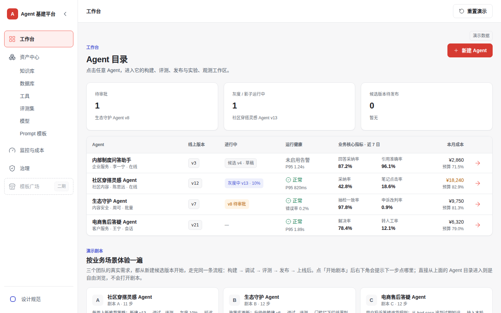
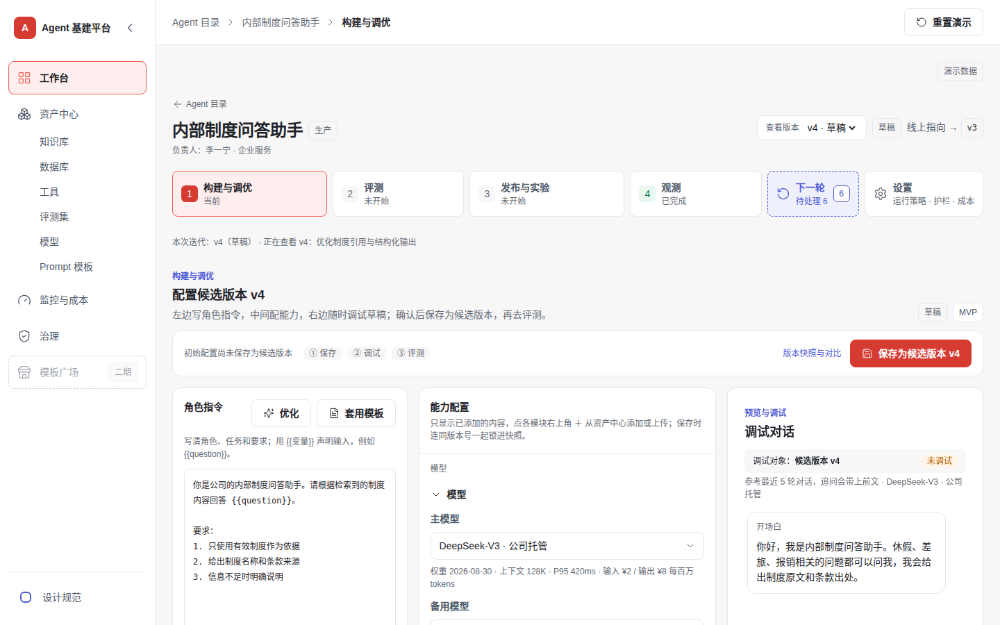
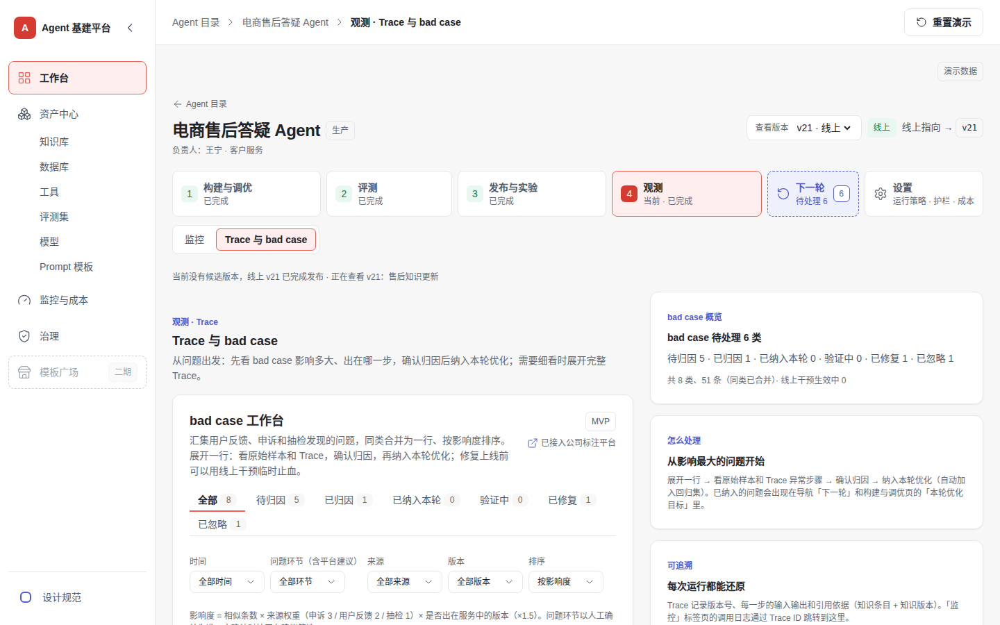

# Agent 基建平台 · 交互原型

公司级 Agent 基建平台的可交互 demo，是产品笔试作答（[笔试作答](Files/Agent基建平台-笔试作答.md)）的配套原型。

> 外部平台解决「怎么把 Agent 做出来」；这个平台解决「公司内任何团队做出来的 Agent，怎样用同一套标准**安全上线、持续变好**，并把能力沉淀给下一个团队」。



## 快速打开

- 用浏览器直接打开 **`dist/index.html`**。这是已经打包好的单个文件，不需要安装依赖，也不需要启动服务。
- 这是纯前端原型，所有数据都是 mock，页面上的数字只用于演示。右上角的「重置演示」可以随时恢复初始状态。
- 推荐用桌面浏览器、1440 宽度查看，窄屏也可以浏览。

## 怎么看：三条演示剧本

工作台下方有三条剧本，分别对应三个业务团队的真实需求。点「开始剧本」后，右下角浮层会提示下一步点哪里，页面上对应的元素会高亮；需要动手改配置的步骤，可以点「代我修改」一键完成。三条剧本结构相同，都从新建候选版本开始，走完 **构建 → 调试 → 评测 → 发布 → 上线后**。

| 剧本 | 业务诉求 | 演示的关键能力 | 步数 |
| --- | --- | --- | --- |
| **A 社区穿搭灵感 Agent**（快） | 每周上新推荐策略 | 新建 v13，调试、评测后比例灰度 10%。AB 报告显示效果更好但更慢，延迟告警触发后一键回退到 v12（用时 1 分 48 秒），再用 Trace 定位到新增步骤 | 11 |
| **B 生态守护 Agent**（准） | 政策库更新 | 升级依赖建 v8。评测门槛拦下红线漏判，发布按钮被禁用；Trace 查到引用了旧条款，修正后重测通过，影子运行验证，审批后全量发布 | 12 |
| **C 电商售后答疑 Agent**（稳） | 用户投诉答错退货规则 | 从 bad case 追到过期知识，纳入本轮优化；新建知识版本并设置生效时间，建 v22 做回归评测，按会话灰度后转人工率 12.1% → 9.6% | 12 |

**只有时间看一条的话，建议看 C。** 它从线上问题出发，完整走了一遍「发现问题 → 归因 → 修复 → 验证上线」的调优闭环。

从 Agent 目录直接点进任何 Agent，进入的是**自由浏览**，不会开始剧本。第四个 Agent「内部制度问答助手」是通用示例，适合自由体验一遍完整路径：构建 v4 → 保存为候选版本 → 评测 → 发布页查看就绪检查（缺告警和审批）→ 在设置页开启告警 → 提交并模拟审批 → 比例灰度 → 放量 → 回退到 v3。

## 设计要点

### 1. 两轴信息架构

外部构建平台（如百度千帆）按「资源」组织导航。这里则以「**Agent 版本 + 线上指向**」为中心，按一个 Agent 怎样上线、怎样变好来组织。

```
横轴 · 平台共享（一级导航，跨 Agent 复用）
  工作台 │ 资产中心（知识库 · 数据库 · 工具 · 评测集 · 模型 · Prompt 模板）│ 监控与成本 │ 治理 │ 模板广场（二期）

纵轴 · 单个 Agent 的生产闭环（进入某个 Agent 后）
  构建与调优 → 评测 → 发布与实验 → 观测（监控 / Trace 与 bad case）→ ↺ 下一轮
```

资产在资产中心登记一次，任何 Agent 都能按版本引用；每个 Agent 内部则按生命周期一步步往前走。



### 2. 版本快照 + 线上指向

- 每个版本都是不可修改的快照，包含模型、Prompt、执行步骤、工具版本、知识版本等。只有候选版本可以编辑。
- 发布、放量、回退都只是切换生产环境的「线上指向」，快照本身不变，所以回退可以做到分钟级。
- 候选版本要先保存、调试，并通过评测的上线门槛，才能发布；门槛没过时，发布按钮是禁用的。

### 3. 调优闭环：由问题驱动下一轮

调优没有单独做一个页面，而是贯穿在迭代里。评测门槛、AB 报告、告警和 bad case 发现的问题，都可以「纳入本轮优化」，然后回到构建与调优去改，再经过调试、评测核对、灰度验证完成闭环。一轮优化 = 一个候选版本 + 一组要解决的问题。

bad case 工作台把同类问题合并成一行，按影响度排序（相似条数 × 来源权重 × 是否出在线上版本）。展开一行可以看原始样本、Trace 摘要和平台建议的归因，确认后一键纳入本轮，并自动加入回归集。



### 4. 生产能力融进流程

上线门槛、灰度与 AB、回退、Trace、护栏、成本这些生产能力，没有做成独立模块，而是放进了对应的步骤：评测页有上线门槛，发布页有生产就绪检查、灰度策略和 AB 报告，观测页有 Trace 和线上干预，设置页有告警、护栏和成本。它们对应笔试作答中从三个业务抽象出的「生产骨架」。

## 范围与边界

- 每个功能标注 **MVP** 或 **二期**。二期功能置灰占位，不实现交互，例如模板广场。
- 不调用任何真实模型或接口：调试、评测、批量任务的结果都是预设数据。「已接入公司 XX 平台」只是说明文字，没有真实对接。
- 没有后端，演示进度保存在浏览器本地存储里；清空浏览器数据或点「重置演示」都会回到初始状态。

## 相关文档

| 文档 | 内容 |
| --- | --- |
| [笔试作答](Files/Agent基建平台-笔试作答.md) | 共性结构抽象（基础能力 + 生产骨架）、完整功能模块与 MVP 边界 |
| [行业与产品调研](Files/Agent开发平台-行业与产品调研.md) | Agent 开发平台的行业现状与竞品分析 |
| [原型搭建方案与提示词](Files/原型搭建方案与提示词.md) | 原型的关键判断、竞品借鉴、页面清单和分步搭建提示词 |
| [项目上下文](Files/PROJECT_CONTEXT.md) | 产品设定、信息架构定稿、各页规则与技术约束 |
| [实现说明](Files/实现说明.md) | 版本模型、调优闭环、bad case、资产修改、剧本机制、存储等交互规则的完整说明 |

## 本地开发

技术栈为 Vite + React + TypeScript + Tailwind，构建产物是一个自包含的 HTML 文件（`vite-plugin-singlefile`，Hash 路由）。

```bash
npm install
npm run dev      # 本地开发
npm run build    # 输出 dist/index.html
```

检查脚本直接打开 `dist/index.html`，所以要先 `npm run build`；首次使用前还要运行 `npx playwright install chromium`。

- `npm run smoke`：把三条演示剧本从头走到尾，并回归检查已修复的问题。
- `npm run snapshot` / `npm run snapshot:compare`：记录基准截图（主要页面 × 1440 / 390 宽），改完后逐像素比对。

## 代码结构

```
src/
├─ data/       mock 数据，唯一入口 data/index.ts；base/ 按功能拆分，scenarios/ 按剧本 A / B / C 拆分
├─ core/       与界面无关的状态（store/）、规则（rules/：版本、门槛、调优、演示时钟）和统一取数（data-access/）
├─ shared/     跨页面复用的组件和样式（设计变量只从 shared/styles/tokens.ts 引用）
├─ features/   一个功能一个文件夹：shell / directory / create / build / evaluation / release / monitor /
│              trace / optimize / settings / library（资产中心）/ operations（监控与成本）/ governance（治理）/
│              playbook（演示剧本）/ design-system / placeholder
└─ types/domain.ts
```

依赖方向为 features → shared → core → data → types，只允许从左往右引用。更多实现细节见 [实现说明](Files/实现说明.md)。
